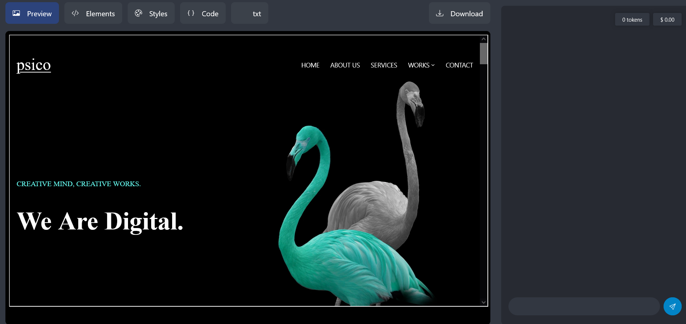

# Theseus-AI

Open AI gpt 3.5 Web Page Designer , Domain Search Engine and Editor. Enables you to create and design web pages with ease.
Grab Web Sites directly in the screen and Live edit with the help of Open AI gpt 3.5 .
ReactJS  based interface designed to edit and create Existing Web Templates or Spin up from scratch.
Grab source code  from any web page and paste into the HTML EDITOR to begin working.
Use in conjunction with Web Scrapbook to grab all website files into one working folder for re working THEMES.


Screnn grab of Theseus running  easy-particles.js interactive web app.

# Interacting with theseus.

The AI chat interface section is text input text out put.
The user connects to openai server via an openai api key , which the user requires in order to use.
Get openai key.

Theseus accepts certain commands or "KEYWORDS" written in plain english and processes them accoringly.

e.g.
```
TYPE : any_domain_name.com   ( .org , .net , .co.uk .....)

AI: Will respond by taking you to the given website and displaying it on screen instantly without any intermediary.

TYPE: time?

AI: Will give you the atomic clock , allowing you to acces the correct time in any country or time zone.
```

Keywords form the basis of a simple to use commend line interface.
```
TYPE: openai

AI: opens a second , larger openai user interface in screen capable of complex code generation tasks in a multitude of languages. ZENDOG-UI.

and answering questions on any subject. All generated code is downloadable at a click.
```
## Features
- Built in Dev server for viewing Web Pages. 
- AI Chat and HTML, CSS, and JS code generation using simple text based Promts.
- Token and price tracker enables user to see the current usage.
-  Python can be generated using "Markdown" in the html editor.
-  PHP can be embeded within the html if required.
-  Built in AI WebSearch capability.Renders target page in user interface.
-  Browse wesites "offline" , in "stealth" Mode via localhost :3000
-  Watch live News Channels , Podcasts , Social Media , e.t.c

  


## Use.
Clear the "Starting code" in the editor and populate the html window by requesting an html template , this will be auto generated upon request.
Use the "Preview" window to view your code changes as you go.
Requested .css or .js will be generated in the .css or .js windows. Writing , cutting and pasting areall enabled if you preffer the style in your
html file just ask Theseus to give you the style tags in the (html) head . 
Scripts can be embedded using <script> tags , again just request the tags via the chat text box.
Theseus is capable of generating javascript for a multitude of purposes.
Ask for img tags and useful urls. Links , iframes e.t.c to populate the web page as desired.
Good quality Web pages can be spun up in no time.
When you are happy - Click the download button.
Job Done !


#Example Search:

Search direct , Instant Search. via domain name.

Just Type a DOMAIN NANE to go to the web page.

e.g 

    TYPE: rt.com
    RESULT: Interactive Live news channal is rendered.Stream Live News.
    TYPE: gutenburg.org
    RESULT: Selection of 70,000 e-books for DOWNLOAD.

    Use any existing domain name for instant search...

## Get Started.
To use Theseus-AI just:

1. Clone the repo.
2. Run `npm install` to install the dependencies.
3. Run `npm start` to start the dev server.
4. Access `http://localhost:3000` in your web browser.

Once you've set up the tool, you can begin constructing your webpage by interacting with the AI via the chat feature located in the sidebar.
Next, you have the option to personalize the HTML, CSS, and JavaScript code utilizing the built-in code editor.


#Credits
Respect due : Carlos Sansón , mojo , zendog , mulciber . 

